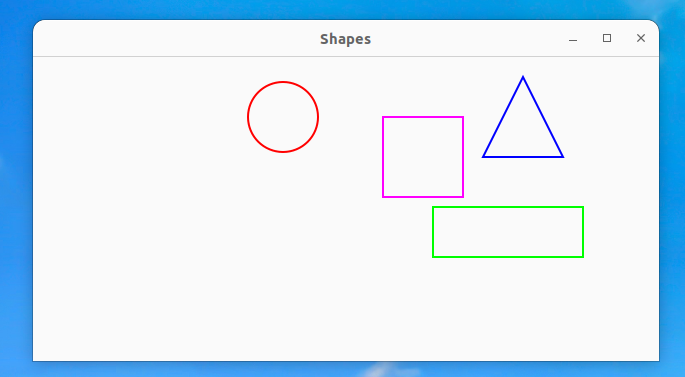

/////////////////////////////////--------------------------------------------------
Проект находится в ветке develop , папка src.

Программа выполнена на языке С++, 17 стандарт  с использованием библиотеки GTK .

Реализация сделана на OS Linux , для windows есть аналогичная библиотеки windows.h 
Проект выполнен в соответствии со стандартом стиля google-style. 
Сборка проекта осуществляется с помощью makefile . Достаточно находясь в директории проекта ввести в терминал команду "make run" .

При отсутствии требуемых библиотек на вашем ПК в случае с OS linux ubuntu нужно установить недостающие пакеты с помощью команд 

sudo apt-get update
sudo apt-get install libgtk-3-dev
sudo apt-get install libpango1.0-dev

/////////////////////////////////--------------------------------------------------

Результат вывода программы 

